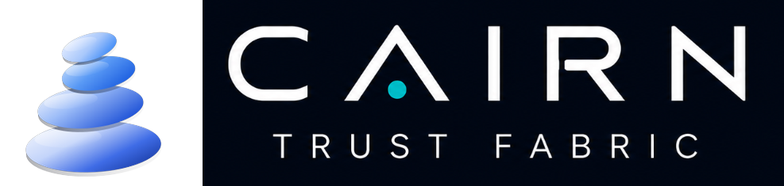

<div align="center">



### The Enterprise Trust Fabric — Secure • Orchestrate • Automate

[](https://github.com/cairn-trust-fabric/cairn/releases)
[](https://cairnetp.com)
[](https://cairnetp.com/#architecture)
[](https://cairnetp.com/compliance.html)
[](https://cairnetp.com)

**We help organisations trust AI.**  
CAIRN inserts a deterministic governance and dual-runtime verification plane between enterprise user intent and autonomous model execution.

[Download Releases](https://github.com/cairn-trust-fabric/cairn/releases/latest) • [Website & Platform](https://cairnetp.com) • [Architecture](https://cairnetp.com/#architecture) • [Compliance Mappings](https://cairnetp.com/compliance.html) • [Licensing & Deployment](https://cairnetp.com/licensing.html)

---

</div>

## About CAIRN Trust Fabric

**CAIRN Trust Fabric** is an enterprise-grade governance and execution plane designed to bring deterministic control, cryptographic verification, and hardware-isolated execution to artificial intelligence systems.

As organisations deploy autonomous AI agents, coding copilots, and multi-model workflows, they encounter a critical structural problem: **probabilistic language models cannot guarantee safety, idempotency, or policy adherence at runtime**. 

CAIRN resolves this by operating as an unbypassable intermediary layer:
* **Default-Deny Ingress**: Intercepts every tool invocation, shell command, code execution request, and outbound network attempt before host exposure.
* **Dual-Runtime Hardware Sandboxes**: Dispatches unverified workloads into ephemeral Linux Docker containers or native Windows Sandbox Hyper-V micro-VMs.
* **Tiered Assurance Verification**: Evaluates actions across a structured 6-tier ladder from unverified strings to deterministic, repeatable outcomes.
* **Cryptographic Decision Ledgers**: Produces tamper-evident audit trails with SHA-256 decision records to satisfy regulatory mandates (EU AI Act, SOC 2, ISO 42001).

---

## The 4-Tier Cairn Trust Architecture

The stacked cairn mark represents the 4-tier execution architecture:

```
         +---------------------------------------+
         |         1. INTENT LAYER (Top)         |  Schema Validation & AST Parsing
         +-------------------+-------------------+
                             |
                             v
         +---------------------------------------+
         |         2. GOVERNANCE LAYER           |  Dynamic RBAC, Egress Gate & ACLs
         +-------------------+-------------------+
                             |
                             v
         +---------------------------------------+
         |         3. EXECUTION LAYER            |  Dual Sandboxes (Docker / WinVM)
         +-------------------+-------------------+
                             |
                             v
         +---------------------------------------+
         |      4. EVIDENCE LAYER (Base)         |  SHA-256 Decision Ledger & SIEM
         +---------------------------------------+
```

1. **Tier 1: Intent & Ingress Gate** — Ingests user and agent intent, validates parameter schemas, performs Abstract Syntax Tree (AST) parsing, and filters prompt injection vectors.
2. **Tier 2: Policy & Governance Engine** — Evaluates organisational policies in microseconds, applying credential redaction, egress domain whitelisting, and strict least-privilege RBAC.
3. **Tier 3: Dual-Runtime Sandbox Execution** — Dynamically routes workloads to read-only Linux Docker containers or isolated Windows Sandbox Hyper-V micro-VMs.
4. **Tier 4: Cryptographic Evidence Ledger** — Generates signed SHA-256 decision records, state-delta hashes, and real-time SIEM event streams.

---

## Verification Assurance Ladder

Every recommendation and automated action is graded across 6 deterministic assurance tiers (ADR-0008 compliant):

| Tier | Status | Verification Stage | Description |
| :---: | :--- | :--- | :--- |
| **0** | `[UNTRUSTED]` | **Unverified** | Raw LLM output string or unparsed external script. |
| **1** | `[INSPECTED]` | **Static Checked** | AST syntax validation, secret regex scan, and boundary parsing. |
| **2** | `[ISOLATED]` | **Sandbox Executed** | Ephemeral container execution with read-only root and zero network egress. |
| **3** | `[OBSERVED]` | **Behaviour Checked** | Memory, disk delta, and network telemetry verified clean. |
| **4** | `[REPRODUCIBLE]` | **Deterministic** | Repeated runs verified to produce identical results across independent seeds. |
| **5** | `[VERIFIED]` | **Idempotent** | State mutations proven safe to repeat without system side-effects. |

---

## Quickstart

1. **Download the latest release** from [GitHub Releases](https://github.com/cairn-trust-fabric/cairn/releases/latest). Take the installer, `SHA256SUMS.txt`, `SHA256SUMS.txt.sig` and `verify-release.cjs`.

2. **Verify the download before installing**. The verifier is a single dependency-free script; you do not need to install or trust CAIRN to run it.

   ```powershell
   node verify-release.cjs
   ```

   It confirms that every file matches the hash recorded when it was built, and that the hash manifest carries a valid signature from the key that signed previous CAIRN releases.

3. **Run the installer.** Read the note below on the Windows warning first.

4. **Tell CAIRN which of your systems matter.** It ships with nothing declared, so
   it grades an action by what kind of thing it is rather than by what it would
   affect, and applies no ceiling to what it may do on its own — and it records
   that absence rather than treating it as approval. Copy a file from
   [`examples/`](examples/) into your vault to change that. Optional, and CAIRN is
   explicit in every decision record about which of these are not in force.

---

## Windows will warn you about this download

Windows will say **"Windows protected your PC"**. That is expected, and you should know why before deciding what to do about it.

That check looks for a code-signing certificate issued by a certificate authority. **CAIRN does not have one** — it is a recurring cost the project has not taken on. The warning means *"this publisher has not paid for an identity check"*, not *"this file is dangerous"*, and the wording does not distinguish the two.

We are not asking you to take that on trust. Verify the download instead.

**What the Ed25519 verification gives you:**
* **Tamper evidence** — a corrupted download, an altered mirror or disk rot all fail the check.
* **Continuity of publisher** — this release is signed by the same key that signed the last one. This is trust-on-first-use, the same model as an SSH host key.

**What it does not give you:**
* **Proof of who holds the signing key.** It is a self-published key, not a CA certificate — anyone can generate one. Before trusting a *first* download, compare the fingerprint the verifier prints against the one published in this repository, which is somewhere a download page cannot change.
* **Suppression of the Windows warning.** Only a CA certificate does that, and there is not one.

**There is no automatic update**, deliberately. An updater that installs unsigned code with no certificate to check against is a worse problem than not having an updater, so it is sequenced behind code signing. To update, download again and re-run the verifier.

---

## Enterprise Compliance Mappings

CAIRN Trust Fabric translates regulatory directives into cryptographic runtime boundary checks:

* **EU AI Act (Regulation 2024/1689)**: Article 14 (Human Oversight & Deterministic Override), Article 15 (Accuracy, Robustness & Cybersecurity), Article 12 (Automatic Record-Keeping).
* **NIST AI RMF 1.0**: GOVERN 1.1–1.6, MAP 2.1, MEASURE 2.5, MANAGE 2.2.
* **ISO/IEC 42001:2023**: Clause 6.1 (AI Risk Assessment), Clause 8.2 (AI System Impact Assessment), Control A.6.2 (Data Provenance & Traceability).
* **SOC 2 Type II**: CC6.1 (Logical Access Security), CC6.6 (Boundary Protection & Default-Deny Ingress), CC7.2 (Continuous Anomaly Monitoring).
* **DORA (EU 2022/2554)**: Article 6 (ICT Risk Management), Article 9 (Protection & Prevention Controls).

For comprehensive compliance matrices and documentation, visit [cairnetp.com/compliance.html](https://cairnetp.com/compliance.html).

---

## Binary Integrity & Verification

Every release ships a SHA-256 manifest of its installers, an Ed25519 signature over that manifest, the public key, and the verifier that checks both. See [Windows will warn you about this download](#windows-will-warn-you-about-this-download) for what that establishes and what it does not.

* **Official Domain**: [https://cairnetp.com](https://cairnetp.com)
* **Publisher**: CAIRN ETP
* **Security Policy**: See [SECURITY.md](SECURITY.md)

### Release signing key

This is the fingerprint `verify-release.cjs` prints. It is published **here**, in the repository, rather than only on the release page — a public key served from the same page as the installer is worth exactly as much as that page.

```
Ed25519  SHA-256  c3b71550dccd03e3503936237a8658b8b773af74843e326e21fdce790c9b7394
```

If the verifier prints a different fingerprint, stop and report it via [SECURITY.md](SECURITY.md).

---

## Commercial Licensing & Enterprise Support

CAIRN Trust Fabric is distributed as open documentation, architecture, and issue tracking with proprietary compiled runtime binaries.

For multi-node enterprise licences, sovereign air-gapped deployments, and custom LLM sandbox integrations, visit the official portal:
* **Licensing Overview**: [cairnetp.com/licensing.html](https://cairnetp.com/licensing.html)
* **Platform Inquiries**: [cairnetp.com](https://cairnetp.com)

---

<div align="center">

**CAIRN Trust Fabric** • *Secure • Orchestrate • Automate*  
(c) 2026 CAIRN ETP. All rights reserved.

</div>
